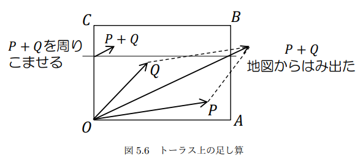

# Learning Programming Bitcoin

The original is [here](https://github.com/jimmysong/programmingbitcoin)

- [Learning Programming Bitcoin](#learning-programming-bitcoin)
  - [1章: 有限体](#1章-有限体)
    - [集合体の定義](#集合体の定義)
    - [モジュロ演算](#モジュロ演算)
    - [有限体の加算と減算](#有限体の加算と減算)
    - [有限体の乗算とべき計算](#有限体の乗算とべき計算)
    - [有限体の除算](#有限体の除算)
    - [フェルマーの小定理](#フェルマーの小定理)
  - [2章: 楕円曲線](#2章-楕円曲線)
    - [定義](#定義)
      - [secq256k1](#secq256k1)
    - [点の加算](#点の加算)
    - [数学的解説](#数学的解説)
  - [3章: 楕円曲線暗号](#3章-楕円曲線暗号)
    - [有限体上の楕円曲線](#有限体上の楕円曲線)
    - [有限体における点の加算](#有限体における点の加算)
    - [楕円曲線のスカラー倍算](#楕円曲線のスカラー倍算)
      - [2進展開 / バイナリ法](#2進展開--バイナリ法)
    - [有限巡回群](#有限巡回群)
    - [ビットコイン用の曲線の定義](#ビットコイン用の曲線の定義)
    - [公開鍵暗号](#公開鍵暗号)
    - [署名と検証](#署名と検証)
      - [署名ハッシュ](#署名ハッシュ)
      - [検証](#検証)
    - [署名の作成](#署名の作成)

## 1章: 有限体

### 集合体の定義

* a + b, a * b が集合内に存在する = 閉じている
* a + 0 = a となる 0 が集合内に存在する
  * この 0 が加法単位元
* a * 1 = a となる 1 が集合内に存在する
  * この 1 が乗法単位元
* a + (-a) = 0 となる -a が集合内に存在する
  * この -a が加法逆元
* a * a^-1 = 1 となる a^-1 が集合内に存在する
  * この a^-1 が乗法逆元
* 体の位数は必ず素数の冪

### モジュロ演算

```text
7 % 3 = 1
```

### 有限体の加算と減算

* 有限体の加算を +f と表現
* 有限体の減算を -f と表現

位数が19の有限体 => F19 = {0, 1, ... 18}


```text
7 +f 8 = (7 + 8) % 19 = 15

11 -f 9 = (11 - 9) % 19 = 2
```

### 有限体の乗算とべき計算

* 有限体の加算を *f と表現

```text
5 *f 3 = 5 +f 5 +f 5 = 15 % 19 = 15

7^3 = 343 % 19 = 1
```

### 有限体の除算

* 有限体の加算を /f と表現

除算は乗算の逆算

通常の数学

* 7 * 8 = 56 は 56 / 8 = 7 を表す

集合体の場合

* `3 *f 7 = 21 % 19 = 2` は `2 /f 7 = 3` を表す
* `9 *f 5 = 45 % 19 = 7` は `7 /f 5 = 9` を表す

### フェルマーの小定理

p を素数とし、a を p の倍数でない整数（a と p は互いに素）とするときに、


すなわち、a の p − 1 乗を p で割った余りは 1 であるというもの。

[フェルマーの小定理 - Wikipedia](https://ja.wikipedia.org/wiki/%E3%83%95%E3%82%A7%E3%83%AB%E3%83%9E%E3%83%BC%E3%81%AE%E5%B0%8F%E5%AE%9A%E7%90%86)

```text
n^(p-1) % p = 1
```

[合同式(mod)の意味とよく使う６つの性質 | 高校数学の美しい物語](https://manabitimes.jp/math/683)

[フェルマーの小定理の証明と例題 | 高校数学の美しい物語](https://manabitimes.jp/math/680)

## 2章: 楕円曲線

### 定義


```text
y^2 = x^3 + a*x + b
```

#### secq256k1

```text
y^2 = x^3 + 7
```


### 点の加算

> 楕円曲線E上に位置する2点  の加算は以下の通りである。
>
> まず、無限遠点を  とすると、  である。すなわち、  が単位元である。
>
> もし  ならば、 である。
>
>
> それ以外の場合、 は、2点  を通る直線とEとの（ および  と異なる）交点の、y座標の符号を反転したものである。すなわち  は以下のようになる。
>
> 
>
> 
>
> ただし  は
>
> 
>
> 
>
> [楕円曲線暗号 - Wikipedia](https://ja.wikipedia.org/wiki/%E6%A5%95%E5%86%86%E6%9B%B2%E7%B7%9A%E6%9A%97%E5%8F%B7)

> と、言葉だけで説明するといまいち良く分からないですね。というか無限遠点って何だ。
>
> とりあえず無限遠点のことは置いといて、無限遠点じゃない点に関しての加法演算を視覚化してみます。
>
> 
>
> P と Q を通る直線と楕円曲線の新たな交点の y 座標を反転した点 R' が一意に定まることが分かるでしょうか。
>
> 一方で、上図の R と R' のように、x軸に対称な2点に加法演算を適用した場合、直線と楕円曲線は新たな交点を作らないので、楕円曲線上の一意な点を作れません。このような場合に解なしとしてしまうと加算群が作れなくなってしまうので、無限遠点が導入されます。
>
> [楕円曲線暗号アルゴリズムを理解する｜TechRacho by BPS株式会社](https://techracho.bpsinc.jp/yoshi/2019_08_16/79280)

### 数学的解説

* 同一性
  * 単位元があること
  * A + I = Aとなる点Iが存在する
  * この点を *無限遠点* と呼ぶ
* 可逆性
  * A + (-A) = I
* 可換性
  * A + B = B + A
* 結合性
  * (A + B) + C = A + (B + C)

## 3章: 楕円曲線暗号

2章の楕円曲線は実数。実数が体の１つ。

実数は無数にあるが、有限体と同じような性質を持つ。

### 有限体上の楕円曲線

F103 で 
 (`y^2 = x^3 + 7`) の曲線で、点(17, 64)が曲線上にあることを証明するには

```
y^2 = 64^2 % 103 = 79
x^3 + 7 = (17^3 + 7) % 103 = 79
```

> 
>
> 有限体 F61 上の楕円曲線 y2 = x3 − x のアフィン点の集合
>
> 
>
> 有限群 F89 上の楕円曲線 y2 = x3 − x のアフィン点の集合
>
> [楕円曲線#有限体上の楕円曲線 - Wikipedia](https://ja.wikipedia.org/wiki/%E6%A5%95%E5%86%86%E6%9B%B2%E7%B7%9A#%E6%9C%89%E9%99%90%E4%BD%93%E4%B8%8A%E3%81%AE%E6%A5%95%E5%86%86%E6%9B%B2%E7%B7%9A)

### 有限体における点の加算

普通にできる。

* [楕円曲線暗号#楕円曲線上の加算 - Wikipedia](https://ja.wikipedia.org/wiki/%E6%A5%95%E5%86%86%E6%9B%B2%E7%B7%9A%E6%9A%97%E5%8F%B7#%E6%A5%95%E5%86%86%E6%9B%B2%E7%B7%9A%E4%B8%8A%E3%81%AE%E5%8A%A0%E7%AE%97)

F223 で 
 (`y^2 = x^3 + 7`) の曲線上で以下を計算する

* (170,142) + (60,139)
* (47,71) + (17,56)
* (143,98) + (76,66)

```py
prime = 223
a = FieldElement(0, prime)
b = FieldElement(7, prime)

# (170,142) + (60,139)
x1 = FieldElement(num=170, prime=prime)
y1 = FieldElement(num=142, prime=prime)
x2 = FieldElement(num=60, prime=prime)
y2 = FieldElement(num=139, prime=prime)
p1 = Point(x1, y1, a, b)
p2 = Point(x2, y2, a, b)
print(p1+p2) # => Point(220,181)_0_7 FieldElement(223)

# (47,71) + (17,56)
x1 = FieldElement(num=47, prime=prime)
y1 = FieldElement(num=71, prime=prime)
x2 = FieldElement(num=17, prime=prime)
y2 = FieldElement(num=56, prime=prime)
p1 = Point(x1, y1, a, b)
p2 = Point(x2, y2, a, b)
print(p1+p2) # => Point(215,68)_0_7 FieldElement(223)

# (143,98) + (76,66)
x1 = FieldElement(num=143, prime=prime)
y1 = FieldElement(num=98, prime=prime)
x2 = FieldElement(num=76, prime=prime)
y2 = FieldElement(num=66, prime=prime)
p1 = Point(x1, y1, a, b)
p2 = Point(x2, y2, a, b)
print(p1+p2) # => Point(47,71)_0_7 FieldElement(223)
```

> 
>
> [クラウドを支えるこれからの暗号技術](https://herumi.github.io/ango/)

### 楕円曲線のスカラー倍算

同じ点の加算ができる。

```
(170, 142) + (170, 142) = 2 * (170, 142)
```

結合性がある。

```
2 * (170, 142) + (170, 142) = 3 * (170, 142)
```

> 楕円曲線上の点と点を掛けるのではなく、点に整数（スカラー）を掛けることに注意。
>
> [楕円曲線暗号#スカラー倍算 - Wikipedia](https://ja.wikipedia.org/wiki/%E6%A5%95%E5%86%86%E6%9B%B2%E7%B7%9A%E6%9A%97%E5%8F%B7#%E3%82%B9%E3%82%AB%E3%83%A9%E3%83%BC%E5%80%8D%E7%AE%97)

スカラー倍算の特性の一つに、計算をせず予測することが非常に難しいという点がある。

> キャラクターの一歩が P だとします．原点から 2 歩進むと 2P の位置にいます．どんどん進んで端に到達すると逆から出てきます．10 歩でも 100 歩でも 10100 歩でも進めます．そして歩いて到達した位置 10P や 100P，10100P は容易に求められます．
>
> さて，移動していたキャラクターはうっかり何歩歩いていたか忘れてしまいました．現在地と自分の一歩から何歩歩いたのか知りたいのです．実はこれはとても難しいことが知られています．一歩 P が決まっているときに
>
> 歩数 n から現在地 nP を求められる ↭ 現在地 nP から n を求められない
>
> 有限体のときと同じく，この非対称性が重要です．
>
> 「P, nP が与えられたときに n を求めよ．」
>
> という問題を楕円離散対数問題（ECDLP : Elliptic Curve DLP）といいます．
>
> [クラウドを支えるこれからの暗号技術](https://herumi.github.io/ango/)


点Gを無限遠点になるまでスカラー倍数する

n*G = 0のとき {G, 2G, 3G, ... nG}

この集合を群と呼ぶ。この集合は n が有限のため、有限群(有限巡回群)になる。

F223で (47,71) のスカラー倍算をしていく。

```py
from ecc import FieldElement, Point
prime = 223
a = FieldElement(0, prime)
b = FieldElement(7, prime)
x = FieldElement(47, prime)
y = FieldElement(71, prime)
p = Point(x, y, a, b)
for s in range(1,21):
    result = s*p
    print('{}*(47,71)=({},{})'.format(s,result.x.num,result.y.num))
```

```text
1*(47,71)=(47,71)
2*(47,71)=(36,111)
3*(47,71)=(15,137)
4*(47,71)=(194,51)
5*(47,71)=(126,96)
6*(47,71)=(139,137)
7*(47,71)=(92,47)
8*(47,71)=(116,55)
9*(47,71)=(69,86)
10*(47,71)=(154,150)
11*(47,71)=(154,73)
12*(47,71)=(69,137)
13*(47,71)=(116,168)
14*(47,71)=(92,176)
15*(47,71)=(139,86)
16*(47,71)=(126,127)
17*(47,71)=(194,172)
18*(47,71)=(15,86)
19*(47,71)=(36,112)
20*(47,71)=(47,152)
```

21*(47,71)は無限遠点になり、22*(47,71) = (47,71)となる。

#### 2進展開 / バイナリ法

log2(n)回のループで乗算が実行可能になる。

```py
def rmul(self, coefficient):
    coef = coefficient
    current = self  # <1>
    result = 0  # <2>
    print(bin(coef), current, result)
    while coef:
        if coef & 1:  # <3>
            result += current
        current += current  # <4>
        coef >>= 1  # <5>
        print(bin(coef), current, result)
    return result

print(rmul(10,11))
```

```text
0b1011 10 0
0b101  20 10
0b10   40 30
0b1    80 30
0b0   160 110
110
```

### 有限巡回群

有限体上の楕円曲線から生成元となる点を取り出すと、有限巡回群を生成できる。

体とは異なり、群にある演算は点の加算のみ。

群には、閉包、可逆性、可換性、結合性などの特性もある。

* 同一性
  * 単位元があること
  * 0 + A = Aとなる点Iが存在する
  * この点を *無限遠点* と呼ぶ
* 閉包
  * aG + bG = (a + b)G
* 可逆性
  * aGが群にある場合、(n - a)Gも群にある
  * aG + (n - a)G = (a + n -a) = nG = 0
* 可換性
  * A + B = B + A
* 結合性
  * (A + B) + C = A + (B + C)

### ビットコイン用の曲線の定義

* 曲線
  * 
  * `y^2 = x^3 + 7`
* 有限体の素数p
  * `p = 2**256 - 2**32 - 977`
* 生成点Gのx, y座標
  * `gx = 0x79be667ef9dcbbac55a06295ce870b07029bfcdb2dce28d959f2815b16f81798`
  * `gy = 0x483ada7726a3c4655da4fbfc0e1108a8fd17b448a68554199c47d08ffb10d4b8`
* Gにより生成される群の位数
  * `0xfffffffffffffffffffffffffffffffebaaedce6af48a03bbfd25e8cd0364141`

```py
gx = 0x79be667ef9dcbbac55a06295ce870b07029bfcdb2dce28d959f2815b16f81798
gy = 0x483ada7726a3c4655da4fbfc0e1108a8fd17b448a68554199c47d08ffb10d4b8
p  = 2**256 - 2**32 - 977
n  = 0xfffffffffffffffffffffffffffffffebaaedce6af48a03bbfd25e8cd0364141
```

### 公開鍵暗号

```text
P = eG
```

PはeとGの値がわかればすぐに計算できる。eの値はPとGがわかっていても簡単には計算できない。

一般に `eを秘密鍵`、`Pを公開鍵`と呼ぶ。

秘密鍵は256bitの数で、公開鍵は座標 (x, y) で、xとyはそれぞれ256bitの数。

### 署名と検証

やりたいこと

* 秘密鍵の数値を知っていることを、秘密鍵の数値を明らかにせずに証明したい

署名アルゴリズム

* 楕円曲線デジタル署名アルゴリズム (Elliptic Curve Digital Signature Algorithm)
  * [楕円曲線DSA - Wikipedia](https://ja.wikipedia.org/wiki/%E6%A5%95%E5%86%86%E6%9B%B2%E7%B7%9ADSA)

秘密鍵は、以下を満たす e。

```text
eG = P
```

Pが公開鍵で、eは秘密鍵。

ランダムな256bitの数字 k で↓を計算する。

```text
kG = R
```

Rのx座標に注目し、これを r とする。

次の方程式が離散対数問題と等価。

```text
uG + vP = kG
```

u, v は 0 ではない値を署名者が選ぶ。G と P は既知。

```text
uG + vP = kG
vP = (k - u)G
```

v != 0 であるため、vで割る

```text
P = ((k - u)/v)G
```

すなわち `e = (k-u)/v` となるので、これを満たす u, v の組み合わせを選ぶ。

eを知らない場合、`e = (k-u)/v`になるまでいろいろ試す必要がある。

離散対数問題は難しいので、e, u, vは定めた人が知っていると考えられる。

#### 署名ハッシュ

署名ハッシュを z とする。 r と s が署名

```text
u = z/s, v = r/s
```

これを解くために s の値を求める。

```text
uG + vP = R = kG
```

`eG = P` なので


```text
uG + veG = kG
u + ve = k
```

`u = z/s, v = r/s` なので

```text
z/s + re/s = k
(z + re) / s = k
s = (z + re) / k
```

この指揮が署名アルゴリズムの基礎。

k が明かされると、いろいろ無駄になるので、k には完全にランダムな値を使う。

#### 検証

署名する対象は固定長の値で 32 byte の値。

署名する対象は G の係数になる。

ドキュメントを hash256 で 32 byte にする。sha256 を2回繰り返すことで、32byte になることが保証される。これが署名ハッシュ zになる。

検証する署名には (r, s) の2つがある。

* r は R の x座標
* s は `s = (z + re) / k`

知っている値

* e (秘密鍵, P = eG)
* k (ランダムな値, kG = R)
* z (署名ハッシュ)

u, v を定義して、 R = uG + vP を次のように構成する

* u = z / s
* v = r / s

こんなふうに展開できる。

```text
uG + vP = (z/s)G + (r/s)P = (z/s)G + (re/s)G = ((z+re)/s)G
```

`s = (z + re) / K` なので

```text
uG + vP = ((z+re)/s)G = ((z+re)/(z+re)/k)G = R
```

検証手順

* 署名を (r,s) 、署名対象のハッシュを z、署名者の公開鍵を P とする
* u = z/s, v = r/s を計算する
* uG + vP = R を計算する
* R の x座標と r が同じ値なら署名は有効

### 署名の作成

署名の手順

* z(署名ハッシュ) が与えられており、eG = P を満たす e(秘密鍵) がわかっているとする
* ランダムに k を選ぶ
* R = kG と r (Rのx座標)を算出する
* s = (z + re)/k を算出する
* 署名は (r, s) となる

P(公開鍵)は、検証したい相手に転送する。z は検証者が必ず知る必要がある。z 算出され、P は署名とともに送信する。


## 4章: シリアライズ

SEC(Standards for Efficient Cryptography)

### 非圧縮SECフォーマット

点 P = (x, y) に対する非圧縮SECフォーマットの生成

1. プレフィクスバイトから始める。 0x04
2. 次に、32 byteのビッグエンディアン整数としてx座標を追加
3. 次に、32 byteのビッグエンディアン整数としてy座標を追加

* ビッグエンディアン
    * 8 bitなので、基数は256
    * 大きいほうから始まる
    * 500 => 01f4 (500 = 1 * 256 + 244 = 0100 + 00f4 = 01f4)
* リトルエンディアン
    * 8 bitなので、基数は256
    * 小さいほうから始まる
    * 500 => f401 (500 = 244 + 1 * 256 = 00f4 + 0100 = f401)

### 圧縮SECフォーマット

楕円曲線は y^2 の項があるので、任意のx座標に対して、最大2つのy座標がある。


```text
y^2 = x^3 + a*x + b
```

上記を満たす任意の (x, y) では (x, -y) も式を満たす。

有限体では -y % p = (p - y) % p となる。P は位数なので2以上の素数なので、必ず奇数になる。

y が奇数の場合、 p - y は偶数になる。つまり y と p - y は一方が奇数、一方が偶数になる。これを利用して非圧縮SECフォーマットを圧縮できる。x座標と、y座標が偶数か奇数かを示せばよい。y座標をシングルバイトに圧縮する(偶数か奇数か)ため、これを圧縮SECフォーマットと呼ぶ。

点 P = (x, y) に対する圧縮SECフォーマットの生成

1. プレフィクスバイトから始める
    1. y が偶数の場合は 0x02
    2. y が奇数の場合は 0x03
2. 次に32バイトのビッグエンディアン整数としてx座標を追加する

#### x座標からy座標の求め方

数学的に表すと、以下のようになる。

```
v　から w^2 = v となるような w を求めよ。
```

位数 p が　p % 4 = 3 を満たす場合、簡単に解ける。

```
P % 4 = 3 => (p + 1) % 4 = 0
```

つまり　(P + 1) / 4 は整数になる。

フェルマーの小定理を使う


```
w^(p-1) % p = 1
```


```
w^2 = v
w^2 = w^2 * 1 = w^2 * w^(p-1) = w^(p+1)
```

結果が整数になる (p + 1) / 4 を次のように用いる。


```
w = w^{(p+1)/2} = w^{2(p+1)/4} = (w^{2})^{(p+1)/4} = v^{(p+1)/4}
```

よって、平方根を求める式はこうなる

```
w^2 = v かつ p%4 = 3 の場合、 w = v^(p+1)/4
```

secp256k1 で用いられる p  P%4 == 3 あんおで以下の式が成り立つ。

```
w = v^(p+1)/4
```

この式であり得る2つの w の値のうち1つが求められ、もう1つは p - w になる。

### パース

* 非圧縮フォーマットは普通に確認する
* 圧縮フォーマットは最初のバイトでy座標が偶数か奇数かわかる
* 楕円曲線の式の右辺の平方根を計算し y の値を求める
* 偶数、奇数を判断して、正しい点を返す

### DER署名

DER(Distinguished Encoding Rules)

* [Abstract Syntax Notation One#DER による符号化例](https://ja.wikipedia.org/wiki/Abstract_Syntax_Notation_One#DER_%E3%81%AB%E3%82%88%E3%82%8B%E7%AC%A6%E5%8F%B7%E5%8C%96%E4%BE%8B)

DER署名フォーマット

* 0x30 ではじめる
* 署名の残りの長さ (0x44 or 0x45)
* マーカーバイト 0x20
* rをビッグエンディアンの整数としてエンコード。rの戦闘が0x80以上の時は先頭に0x00をつける
* マーカーバイト 0x20
* sをビッグエンディアンの整数としてエンコード。rの戦闘が0x80以上の時は先頭に0x00をつける

### Bas58

* [Base58 - Wikipedia](https://ja.wikipedia.org/wiki/Base58)

```
Base58は、データを58種類の印字可能な英数字のみを用いて、それ以外の文字を扱うことの出来ない通信環境にてマルチバイト文字やバイナリデータを扱うためのエンコード方式である。Base64に似ているが、英数字以外の文字や印刷した場合に違いのわかりにくい文字を排するような変更がなされている。これは生身の人間であるユーザーが手動でデータを入力したり、視覚的な情報源から目でコピーすることを想定しているほか、ダブルクリック一発で文字列すべてを選択し楽にコピー＆ペーストができるように設計されているためである。

Base58ではBase64から数字の0と大文字のＯ、大文字のIと小文字のlの英数字といった区別しづらい文字や、英数字以外の特殊文字である+(プラス)/(スラッシュ)を取り除いた文字セットで表現される。Base58はエンコード時のデータの分割単位が58と2の冪の数ではないため、Base64のように元データをビット毎に分割することができない。このため大きいバイナリデータをエンコードすることは不得手であり、専ら大きな整数をエンコードするのに用いられる。 後述の例のように文字セットの並び順の正しい規定が存在せず個別の実装に依存しており、同じ"Base58"という名前でも複数のフォーマットが存在する。派生フォーマットとして文字セットから更に数字の1と小文字のoの2文字を取り除いたBase56というものも存在する。

Base58Checkは最初と最後の数文字でそれぞれデータ種別とエラー検出符号を付加するBase58エンコードフォーマットであり、ビットコインのアドレスはこの形式をとっている。
```

### アドレス形式

圧縮SECは 264byte と長い。アドレスを短くして安全性を高めるために ripend160 ハッシュを使う。
SECフォーマットを直接使わないことで、アドレスを 33byte から 20byte にできる。

ビットコインアドレスの作成方法

1. メインネットアドレスは先頭を 0x00、テストネットは 0x60 で開始
2. SECフォーマットを取り出し、sha256操作とripend160ハッシュ操作を行う
    * これを hash160 操作と呼ぶ
3. 1と2を結合する
4. 3に hash256 を行い最初の4byteを取得
    * チェックサム
5. 3と4を結合して、Base58でエンコードする

### WIF (Wallet Import Format)

* [Wallet import format - Bitcoin Wiki](https://en.bitcoin.it/wiki/Wallet_import_format)

WIFの作成方法

1. メインネットの秘密鍵は 0x80、テストネットの秘密鍵は 0xef のプレフィクス
2. 秘密鍵を32byteのビッグエンディアンでエンコードする
3. 公開鍵アドレスのSECフォーマットが圧縮形式の場合は、末尾に 0x01 を追加
4. 1, 2, 3 の順に結合
5. 4 に hash256 して最初の 4byte を取得
6. 4, 5を結合させて、Base58にエンコード
