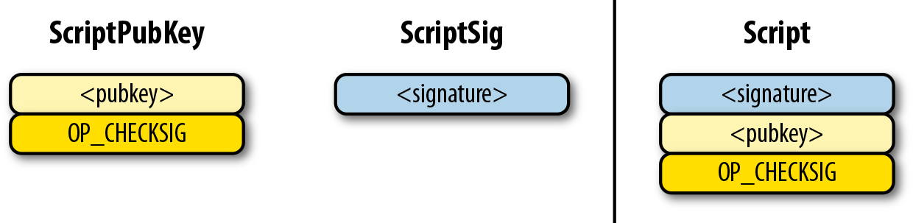

# Making Transaction

AliceがBobに1BTC支払うケースを考える。

ざっくりとした流れはこんな感じ。

* Alice のウォレットがトランザクションを作る
  * Input の作成
    * Bob に送金できる金額があるか、UTXO(未使用のアウトプット) を確認
      * ウォレットが確認する
        * ほとんどのウォレットは UTXO を保持するデータベースを持っていて、秘密鍵でロックされている
        * あるいはフルノードに JSON RPC API を通して問い合わせる
    * Alice の UTXO を集める
      * 前に受け取ったビットコインへの参照を集める
      * 手数料を含めた金額分集める
  * Outputs の作成
    * Bob に送金するためのアウトプット
    * Alice へのお釣りのアウトプット
  * Inputs の Unlocking Script (ScriptSig) を作る
    * 作ったトランザクションに署名する
    * 支払う本人のビットコインであるという証明する
      * ECDSAを用いてAliceの秘密鍵で署名する

## Transaction Structure

トランザクションの構成

画像は https://github.com/bitcoinbook/bitcoinbook/ より引用

* Version
* Inputs
  * Input
    * Previous transaction ID
      * 未使用のトランザクションのhash256
    * Previous transaction index
      * 未使用のトランザクションのOutputのインデックス
    * Unlocking Script (ScriptSig)
      * Transactionの署名とScript
    * Sequence
* Outputs
  * Output
    * amount
    * Locking Script (ScriptPubKey)
* Locktime

## Flow

1BTC以上になるように UTXO から未使用のトランザクションを検索する。

UTXO から未使用のトランザクションを検索するというのは、Alice が使っていない Output を見つけること。

Outputには Locking Script (ScriptPubKey) が入っている。

p2pk の場合はこんな感じ。pubkey には **Alice の公開鍵** が入っている。これが **Alice のアドレス** になる。

画像は https://github.com/jimmysong/programmingbitcoin より引用

p2pkhの場合はこんな感じ。hash には **Aliceの公開鍵のHash160** が入っている。これが **Aliceのアドレス** になる。

画像は https://github.com/jimmysong/programmingbitcoin より引用

このOutputから、新しいトランザクションを作る。

* Inputs
  * Input
    * Previous transaction ID
      * 未使用のトランザクションのhash256 => 該当するOutputを含むトランザクションの hash256
    * Previous transaction index
      * 未使用のトランザクションのインデックス => 該当するOutputのIndex
    * Unlocking Script (ScriptSig)
      * Transactionの署名とScript => **この時点では空**
    * Sequence

次に新しいトランザクションのOutputを作る。

* Outputs
  * Output
    * amount
    * Locking Script (ScriptPubKey)

Outputsは、Bob宛の1BTCと自分宛てのお釣りを含むことが多い。

* Bobへの1BTC分のOutput
* Aliceへのお釣り

p2pkの場合は、Locking Script (ScriptPubKey) の pubkey には **Bob の公開鍵** が入っている。これが **Bob のアドレス** になる。

p2pkhの場合は、Locking Script (ScriptPubKey) の hash には **Bob の公開鍵の Hash160** が入っている。これが **Bob のアドレス** になる。

作ったトランザクションのハッシュを ECDSA (楕円曲線デジタルで署名アルゴリズム) で、Aliceの秘密鍵を使って署名する。

p2pkの場合は、Unlocking Script (ScriptSig) の signature に作成した署名を入れる。

p2pkhの場合は、Unlocking Script (ScriptSig) の signature に作成した署名を入れる。また pubkey には Alice の 公開鍵を入れる。

Locking Script (ScriptPubKey) と Unlocking Script (ScriptSig)を結合し、評価することでトランザクションの検証ができる。